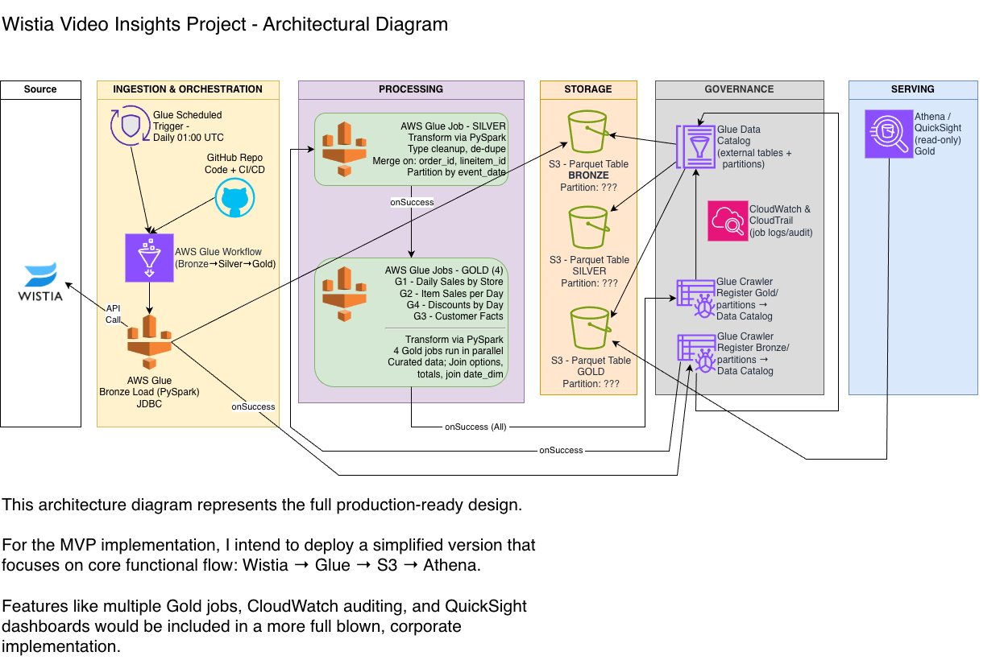

# 🎬 Wistia Video Insights Project

### End-to-End Data Engineering Pipeline

**Tech Stack:** AWS Glue • S3 • Athena • PySpark • Streamlit • GitHub Actions (CI/CD)

---

## 🧠 Business Objective

The marketing team uses Wistia to track video engagement across Facebook and YouTube.
The goal of this project is to design and implement a **data pipeline** that:

* Collects media-level and visitor-level analytics from Wistia’s Stats API
* Automates daily ingestion, transformation, and aggregation of performance metrics
* Delivers curated datasets and visual dashboards to improve marketing insights and strategy

This project simulates a real-world data engineering assignment where full responsibility for architecture, data processing, and reporting is placed on the engineer.

---

## 🏗️ Architecture Overview



### **Summary**

The Wistia Video Insights pipeline automates the flow of engagement data from **Wistia → AWS → Streamlit**, transforming raw JSON into analytical datasets ready for visualization.

| Layer                         | Key Components                             | Description                                                                                                   |
| ----------------------------- | ------------------------------------------ | ------------------------------------------------------------------------------------------------------------- |
| **Source**                    | Wistia Stats API                           | Retrieves media- and visitor-level engagement metrics                                                         |
| **Ingestion & Orchestration** | GitHub Actions (CI/CD) → AWS Glue Workflow | GitHub triggers daily pipeline execution; workflow orchestrates Bronze → Silver → Gold transformations        |
| **Bronze (Raw)**              | S3 Raw JSON                                | Stores unmodified Wistia API data for auditability                                                            |
| **Silver (Refined)**          | AWS Glue (PySpark)                         | Cleanses and standardizes schema; dedupes and partitions data by `load_date`                                  |
| **Gold (Curated)**            | AWS Glue (PySpark + saveAsTable)           | Aggregates KPIs (plays, visitors, engagement, play rate); automatically registers tables in Glue Data Catalog |
| **Governance**                | Glue Data Catalog, CloudWatch              | Tracks table metadata and job run logs                                                                        |
| **Serving**                   | Athena                                     | Provides SQL query access to Silver/Gold data for validation and ad-hoc analytics                             |
| **Visualization**             | Streamlit (Plotly)                         | Displays KPIs and trends via interactive dashboards                                                           |

> **Note:** For this MVP, daily orchestration is managed by **GitHub Actions**.
> In production, this would be decoupled into **AWS Glue Scheduler** (for daily triggers) and **GitHub Actions** (for CI/CD deployments).

---

## ⚙️ Data Flow

1. **Ingestion:**

   * Python scripts call Wistia’s Stats API to extract media- and visitor-level engagement data.
   * Responses are written as raw JSON files to the Bronze S3 layer.

2. **Transformation:**

   * AWS Glue (PySpark) converts Bronze JSON → Silver Parquet, applying type cleanup, deduplication, and partitioning by `load_date`.
   * Additional Glue jobs produce Gold-level Parquet tables using aggregation and joins.

3. **Storage & Governance:**

   * PySpark `saveAsTable()` automatically registers Silver and Gold tables in the Glue Data Catalog.
   * Bronze remains unregistered for transparency and replayability.

4. **Serving & Visualization:**

   * Athena reads Silver and Gold tables for validation and exploration.
   * Streamlit connects to Athena and presents daily KPIs and trend visualizations.

---

## 📊 Streamlit Dashboard

The Streamlit dashboard provides real-time visualization of Wistia video performance.
Key features include:

* **KPI Cards** for Total Plays, Total Visitors, Average Play Rate (%), and Average Engagement (%)
* **Plays vs Visitors Chart** for media-level comparisons
* **Engagement & Play Rate Trend Chart** highlighting changes over time
* **Dynamic Date Filtering** to compare current vs previous periods

Even though the dataset is intentionally small (limited to two user IDs), the dashboard demonstrates how real-world stakeholders could explore engagement insights once connected to full Wistia production data.

Example screenshots to include:

```
/images/streamlit_kpi.png
/images/streamlit_trend.png
```

---

## 🧠 Business Objective vs Implementation

This project fulfills the business objective **functionally** by implementing the end-to-end architecture required for scalable video analytics, even with a limited dataset.

| Objective                                       | Implementation                                                                 |
| ----------------------------------------------- | ------------------------------------------------------------------------------ |
| **Collect media- and visitor-level analytics**  | Python API scripts ingest Wistia data into S3 Bronze                           |
| **Automate daily ingestion and transformation** | GitHub Actions triggers AWS Glue workflow (Bronze→Silver→Gold)                 |
| **Curate metrics for insight generation**       | Gold tables aggregate key KPIs and register automatically in Glue Data Catalog |
| **Provide data for marketing optimization**     | Streamlit dashboard visualizes KPIs and trends through Athena queries          |

In a production environment, this same architecture could easily scale to thousands of videos and millions of visitor events, supporting robust marketing analytics and strategy.

---

## 🔩 Tech Stack

| Category                  | Tools / Services                               |
| ------------------------- | ---------------------------------------------- |
| **Source APIs**           | Wistia Stats API                               |
| **Data Processing**       | AWS Glue (PySpark)                             |
| **Storage Layers**        | Amazon S3 (Bronze: JSON, Silver/Gold: Parquet) |
| **Metadata & Governance** | Glue Data Catalog, CloudWatch                  |
| **Orchestration**         | GitHub Actions (CI/CD), AWS Glue Workflow      |
| **Query Layer**           | Amazon Athena                                  |
| **Visualization**         | Streamlit (Plotly, Pandas)                     |
| **Version Control**       | GitHub                                         |

---

## 🧩 Key Learnings

* Designing medallion architecture (Bronze → Silver → Gold) for API-sourced datasets
* Automating table registration via PySpark `saveAsTable()` instead of Crawlers
* Handling schema evolution and incremental data ingestion
* Building Streamlit dashboards for data storytelling
* Managing CI/CD and daily automation with GitHub Actions

---

## 🚀 Future Enhancements

* Enable **AWS Glue Triggers** for independent daily orchestration
* Integrate **QuickSight dashboards** for enterprise-level BI reporting
* Add **API pagination and incremental date-based pulls**
* Extend metrics with **channel (Facebook/YouTube)** segmentation
* Implement **unit tests and data quality checks** via `pytest` and dbt tests
* Scale to **production Wistia accounts** for realistic engagement volume

---

## 👨‍💻 Author

**Rich Kindle**
*Data Engineer • Musician • Creator*
📧 https://github.com/kindlerl


